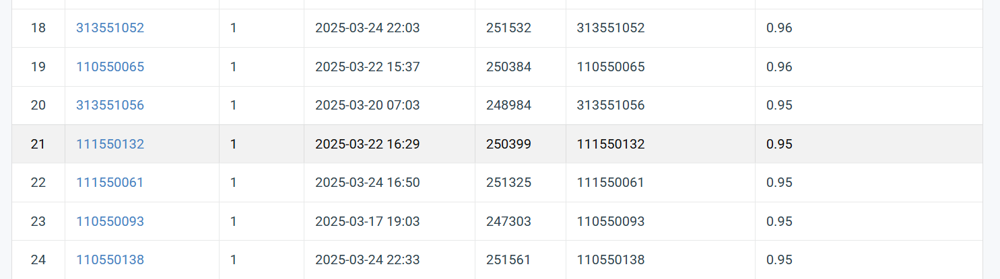

# NYCU VRDL 2025 Spring HW1

StudentID: 111550132

Name: 張家睿

## Introduction
#### Single model:
* training model: ResNext_v4.py
* testing model: test_v4.py
* drawing confusion matrix: confusion_matrix.py
#### compose multi models to single model:
* model soup: model_soup.py
* greedy soup: greedy_soup.py
* model stock: model_stock.py

## How to install
Download the environment.yml, execute this lines in a computer with conda.
```
conda env create -f environment.yml -n env
# after creating env
conda activate env
python ./ResNext_v4.py
```

## Performance snapshot
